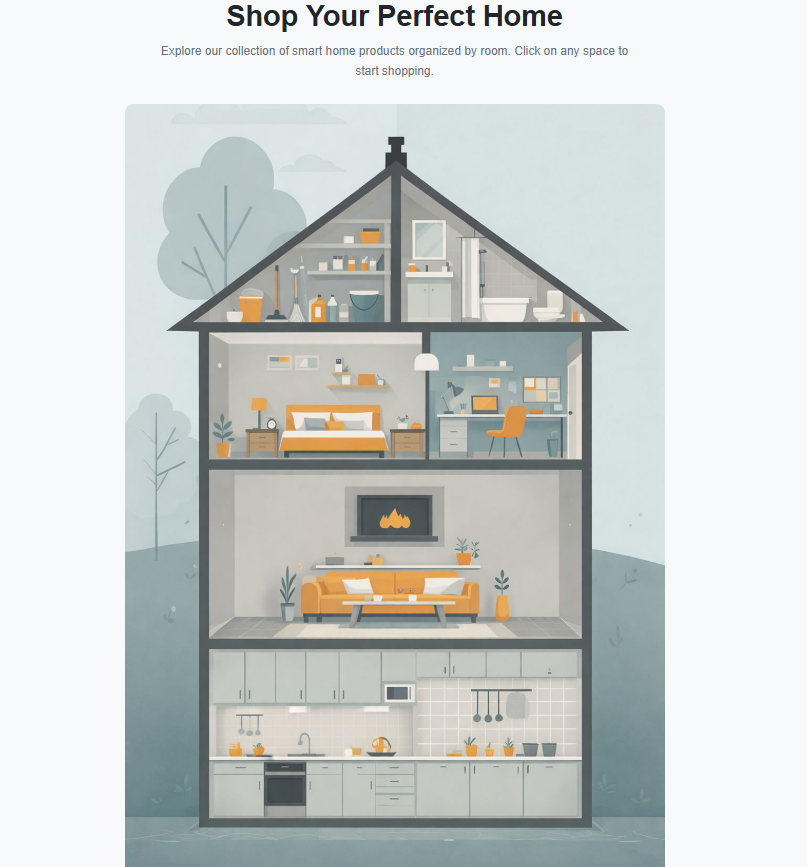
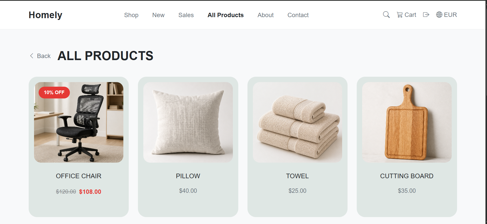
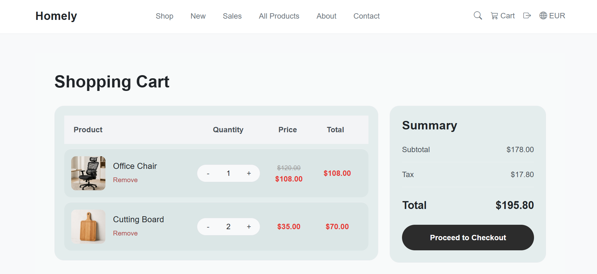
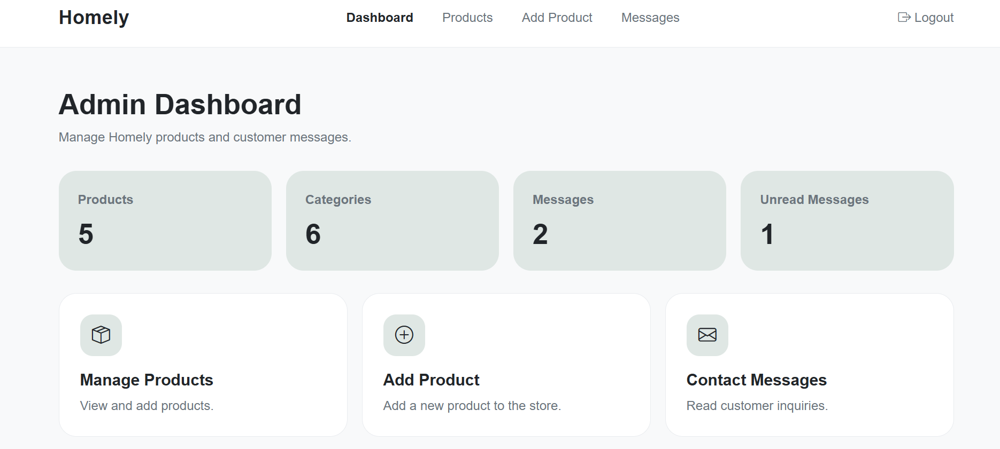
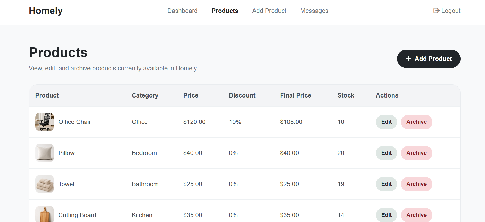
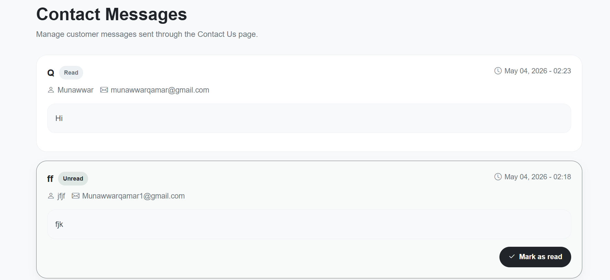

# 🏠 Homely | E-Commerce Web Application

> A modern full-stack e-commerce platform for home products, built using Django as a **solo project** during the Full Stack Bootcamp at **AXSOS Academy**.

---

## 🚀 Project Overview

Homely is a complete web-based e-commerce system that simulates a real-world online store experience.

The platform allows users to browse and search products, manage their cart, and contact the store, while providing admins with a powerful dashboard to manage products, monitor messages, and control store content efficiently.

This project focuses on **clean UI/UX, real-world functionality, and secure system design**.

---

## ✨ Key Features

### 👤 User Side
- User registration & login (session-based authentication)
- Browse products by category
- Product search functionality
- Product details page
- Shopping cart with real-time updates (AJAX)
- Contact form with email integration

---

### 🛠️ Admin Dashboard
- Admin-only dashboard access
- Add / edit products
- Upload product images
- Archive products (soft delete instead of permanent removal)
- View customer messages
- Mark messages as read

---

## 🧠 Technologies Used

| Technology | Purpose |
|-----------|--------|
| Django (Python) | Backend framework |
| MySQL | Database |
| Bootstrap 5 | Responsive UI |
| JavaScript + AJAX | Dynamic interactions |
| Pillow | Image handling |
| SMTP (Gmail) | Email system |
| Git & GitHub | Version control |

---

## 🔐 Security & Validation

- CSRF Protection
- Password hashing
- Server-side validation
- Image file validation (only images allowed)
- Role-based access control (Admin vs User)
- SQL Injection protection (Django ORM)

---

## 📡 API Endpoint

```
/api/products/
```

Returns product data in JSON format.

---

## 🖼️ Screenshots

> Add your screenshots inside a folder named `Screenshots`

| Home | Products | Cart |
|------|---------|------|
|  |  |  |

| Admin Dashboard | Admin Products | Messages |
|-----------------|---------------|----------|
|  |  |  |

---

## 📁 Project Structure

```
homely/
├── store/
│   ├── models.py
│   ├── views.py
│   ├── urls.py
│   ├── templates/
│   └── static/
├── media/
├── Screenshots/
├── manage.py
├── requirements.txt
└── README.md
```

---

## ⚙️ Setup & Installation

### 1. Clone the project
```
git clone https://github.com/your-username/homely.git
cd homely
```

### 2. Create virtual environment
```
python -m venv env
env\Scripts\activate
```

### 3. Install dependencies
```
pip install -r requirements.txt
```

> If you don't have requirements.txt:
```
pip freeze > requirements.txt
```

### 4. Run migrations
```
python manage.py migrate
```

### 5. Run server
```
python manage.py runserver
```

---

## 👤 Roles

### User
- Can browse, search, and shop

### Admin
- Can manage products and messages through dashboard

---

## 🎯 Project Purpose

This project was built as a **solo educational project** during AXSOS Academy Bootcamp to demonstrate:

- Full-stack development skills
- Real-world system implementation
- Clean UI/UX design
- Admin vs User role management

---

## 🚧 Future Improvements

- Payment integration
- Order tracking system
- Wishlist feature
- Product reviews
- Advanced filters
- Deployment on AWS

---

## 👩‍💻 Author

**Munawwar Qamar**  
Frontend & Full Stack Developer

---

## 📄 Notes

This project is built for educational purposes and showcases practical implementation of an e-commerce system.
